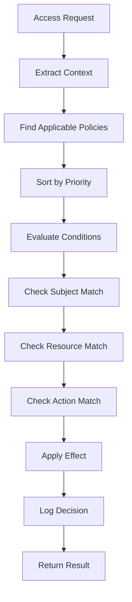

# Policy-Based Access Control (JSON Config) - Design Document

## Overview

This document outlines the design for Issue #19: Policy-Based Access Control (JSON Config), which will implement a flexible, JSON-based policy system for amdWiki's access control framework.

## Current State Analysis

### ✅ Existing Infrastructure

- **ACLManager**: Core access control with page-level permissions
- **UserManager**: User and role management
- **Config System**: JSON-based configuration management
- **Context-Aware Permissions**: Time-based and maintenance mode support

### 🎯 Enhancement Goals

- **Flexibility**: JSON-based policy definitions
- **Granularity**: Fine-grained permission control
- **Maintainability**: Easy policy management and updates
- **Auditability**: Policy evaluation logging
- **Scalability**: Support for complex organizational structures

## Policy Schema Design

### Core Policy Structure

```json
{
  "policies": [
    {
      "id": "admin-full-access",
      "name": "Administrator Full Access",
      "description": "Full access for system administrators",
      "priority": 100,
      "effect": "allow",
      "subjects": [
        {
          "type": "role",
          "value": "admin"
        }
      ],
      "resources": [
        {
          "type": "page",
          "pattern": "*"
        },
        {
          "type": "attachment",
          "pattern": "*"
        }
      ],
      "actions": ["view", "edit", "delete", "upload", "admin"],
      "conditions": [],
      "metadata": {
        "created": "2025-09-14T12:00:00Z",
        "author": "system",
        "tags": ["admin", "full-access"]
      }
    }
  ]
}
```

### Policy Components

#### 1. Policy Identification

- **id**: Unique identifier (string)
- **name**: Human-readable name
- **description**: Policy purpose and scope
- **priority**: Evaluation order (higher = evaluated first)

#### 2. Policy Effect

- **effect**: "allow" | "deny"
- **Determines final access decision**

#### 3. Subjects (Who)

```json
{
  "subjects": [
    {
      "type": "user",
      "value": "john.doe"
    },
    {
      "type": "role",
      "value": "editor"
    },
    {
      "type": "group",
      "value": "marketing-team"
    },
    {
      "type": "attribute",
      "key": "department",
      "value": "engineering"
    }
  ]
}
```

#### 4. Resources (What)

```json
{
  "resources": [
    {
      "type": "page",
      "pattern": "/docs/*"
    },
    {
      "type": "attachment",
      "pattern": "*.pdf"
    },
    {
      "type": "category",
      "value": "System"
    },
    {
      "type": "tag",
      "value": "confidential"
    }
  ]
}
```

#### 5. Actions (How)

```json
{
  "actions": [
    "view",
    "edit",
    "delete",
    "rename",
    "upload",
    "download",
    "admin",
    "export"
  ]
}
```

#### 6. Conditions (When/Where)

```json
{
  "conditions": [
    {
      "type": "time",
      "schedule": "business-hours"
    },
    {
      "type": "ip-range",
      "ranges": ["192.168.1.0/24", "10.0.0.0/8"]
    },
    {
      "type": "user-attribute",
      "key": "clearance-level",
      "operator": ">=",
      "value": "secret"
    },
    {
      "type": "context",
      "key": "is-emergency",
      "value": true
    }
  ]
}
```

## Policy Engine Architecture

### Core Components

#### 1. PolicyManager

- **Load policies** from JSON configuration
- **Validate policy syntax** and structure
- **Cache policies** for performance
- **Provide policy CRUD operations**

#### 2. PolicyEvaluator

- **Evaluate policies** against access requests
- **Handle policy priority** and conflict resolution
- **Support condition evaluation**
- **Generate audit logs** for policy decisions

#### 3. PolicyValidator

- **Schema validation** for policy definitions
- **Conflict detection** between policies
- **Security validation** to prevent privilege escalation
- **Performance validation** for policy complexity

### Policy Evaluation Flow



### Integration Points

#### 1. ACLManager Integration

```javascript
// In ACLManager.checkAccess()
const policyResult = await this.policyManager.evaluatePolicies(context);
if (policyResult.hasDecision) {
  return policyResult.decision;
}
// Fall back to existing ACL logic
```

#### 2. Route Middleware

```javascript
app.use('/admin', policyMiddleware('admin-access'));
app.use('/api', policyMiddleware('api-access'));
```

#### 3. Page-Level Permissions

```javascript
// Policy-based page restrictions
const pagePolicies = await policyManager.getPoliciesForResource('page', pageName);
```

## Configuration Structure

### Main Configuration File

```json
{
  "accessControl": {
    "policies": {
      "enabled": true,
      "configFile": "./config/policies.json",
      "defaultEffect": "deny",
      "evaluationMode": "first-applicable",
      "cache": {
        "enabled": true,
        "ttl": 300
      }
    }
  }
}
```

### Policy File Structure

```bash
config/
├── policies.json          # Main policy definitions
├── policy-schemas.json    # JSON schema for validation
└── policy-templates/      # Reusable policy templates
    ├── admin-policies.json
    ├── user-policies.json
    └── department-policies.json
```

## Admin Interface Design

### Policy Management Dashboard

- **Policy List**: View all policies with status and priority
- **Policy Editor**: Create/edit policies with form validation
- **Policy Tester**: Test policies against sample requests
- **Conflict Detector**: Identify policy conflicts and overlaps
- **Audit Viewer**: View policy evaluation history

### Policy Editor Features

- **Visual Policy Builder**: Drag-and-drop policy creation
- **Template Library**: Pre-built policy templates
- **Validation Feedback**: Real-time syntax and logic validation
- **Import/Export**: JSON import/export for backup/sharing

## Security Considerations

### Policy Security

- **Privilege Escalation Prevention**: Validate policy effects don't grant excessive permissions
- **Circular Reference Detection**: Prevent policies that reference themselves
- **Resource Pattern Validation**: Ensure patterns don't expose unintended resources

### Runtime Security

- **Input Validation**: Sanitize all policy inputs
- **Rate Limiting**: Prevent policy evaluation abuse
- **Audit Logging**: Log all policy changes and evaluations
- **Access Control**: Restrict policy management to administrators

## Performance Optimization

### Caching Strategy

- **Policy Cache**: Cache compiled policies in memory
- **Evaluation Cache**: Cache recent evaluation results
- **Resource Pattern Cache**: Cache compiled regex patterns

### Optimization Techniques

- **Lazy Loading**: Load policies on-demand
- **Policy Indexing**: Index policies by subject/resource/action
- **Batch Evaluation**: Evaluate multiple policies efficiently
- **Async Processing**: Non-blocking policy evaluation

## Testing Strategy

### Unit Tests

- **Policy Evaluation**: Test individual policy rules
- **Condition Evaluation**: Test complex conditions
- **Conflict Resolution**: Test policy priority handling
- **Performance**: Test evaluation speed and memory usage

### Integration Tests

- **Full Access Flow**: Test complete request-to-decision flow
- **Policy Changes**: Test policy updates without restart
- **Error Handling**: Test malformed policies and edge cases
- **Load Testing**: Test performance under high load

### Policy Test Scenarios

```json
{
  "testCases": [
    {
      "name": "Admin Full Access",
      "subject": {"user": "admin", "roles": ["admin"]},
      "resource": {"type": "page", "name": "SystemConfig"},
      "action": "edit",
      "expected": "allow"
    },
    {
      "name": "User Restricted Access",
      "subject": {"user": "user1", "roles": ["user"]},
      "resource": {"type": "page", "name": "AdminPage"},
      "action": "view",
      "expected": "deny"
    }
  ]
}
```

## Implementation Roadmap

### Phase 1: Core Policy Engine (Week 1-2)

- [ ] Design and implement policy schema
- [ ] Create PolicyManager class
- [ ] Implement basic policy evaluation
- [ ] Add policy validation

### Phase 2: Advanced Features (Week 3-4)

- [ ] Implement condition evaluation
- [ ] Add policy caching
- [ ] Create admin interface
- [ ] Add conflict detection

### Phase 3: Integration & Testing (Week 5-6)

- [ ] Integrate with ACLManager
- [ ] Add comprehensive tests
- [ ] Performance optimization
- [ ] Documentation and examples

## Success Metrics

- **Functionality**: All policy types working correctly
- **Performance**: <50ms policy evaluation time
- **Security**: Zero privilege escalation vulnerabilities
- **Usability**: Admin can create policies without technical issues
- **Maintainability**: Easy policy updates and troubleshooting

This design provides a solid foundation for flexible, enterprise-grade access control while maintaining amdWiki's simplicity and performance.
